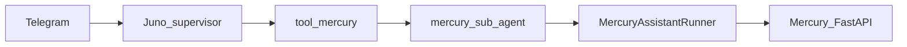

# Juno implementation plan

## Goal

Ship a runnable **Juno** on **Telegram** using the **supervisor + sub-agents-as-tools** pattern from LangChain: the supervisor is built with **`create_agent`** (LangGraph-based runtime); each assistant is a **tool** that invokes a **sub-agent**; sub-agent tools call **`AssistantRunner`** (HTTP to Mercury). **Mercury is a separate deployable**; Juno uses `MERCURY_BASE_URL` only.

## LangChain / LangGraph alignment (official docs)

Use these as the source of truth while implementing:

- **Agents overview:** [`create_agent`](https://docs.langchain.com/oss/python/langchain/agents) builds a **graph-based** agent (LangGraph); pass `model` as a string (e.g. `"openai:gpt-5.4"`) or a chat model instance (`ChatOpenAI`, etc.), `tools=[...]`, optional `system_prompt`, `middleware`, `checkpointer`, `state_schema`.
- **Subagents pattern:** [Multi-agent: Subagents](https://docs.langchain.com/oss/python/langchain/multi-agent/subagents) — supervisor coordinates specialists **via tools**; **tool-per-agent** matches Juno (`mercury`, future assistants). Wrap pattern: `subagent.invoke({"messages": [...]})` then return **`result["messages"][-1].content`** (or equivalent final message) to the supervisor, as in the doc’s basic implementation.
- **Tutorial (personal assistant):** [Subagents personal assistant](https://docs.langchain.com/oss/python/langchain/multi-agent/subagents-personal-assistant) — high-level tool docstrings drive routing; same structure for `mercury(request: str)`.
- **Short-term memory / threads:** [Short-term memory](https://docs.langchain.com/oss/python/langchain/short-term-memory) — pass `checkpointer=InMemorySaver()` to `create_agent`; invoke with `{"configurable": {"thread_id": "<telegram_chat_id>"}}`. For production, plan migration to **`PostgresSaver`** (doc shows `langgraph-checkpoint-postgres`).
- **Custom state for session fields:** Extend **`AgentState`** with `user_id`, `wallet_id`, `chain` (and optionally `approval_response`) and pass `state_schema=CustomAgentState` to **`create_agent`** so Mercury tools read session from **graph state** on each `invoke` instead of only globals (see “Customizing agent memory” on the short-term memory page).
- **Streaming (Telegram UX):** [Streaming](https://docs.langchain.com/oss/python/langchain/streaming) — use `agent.stream(..., stream_mode="messages" | "updates", version="v2")` to surface tokens or step updates for “typing” / progress; optional for MVP, `invoke` alone is enough.
- **Human-in-the-loop (LangChain-native):** [Human-in-the-loop](https://docs.langchain.com/oss/python/langchain/human-in-the-loop) — `HumanInTheLoopMiddleware` + checkpointer + **`Command(resume=...)`** for tool-call interrupts. **Juno MVP:** prefer **Mercury’s** `wallet_approval_required` surfaced in Telegram (application-level), not LangChain HITL on the same wallet action, unless you explicitly want two gates—document if both are ever enabled.

**Optional later:** [Middleware: state-based tool filtering](https://docs.langchain.com/oss/python/langchain/agents) (`wrap_model_call` / `request.override(tools=...)`) to expose only `mercury` until user/session is authenticated.

## Architecture (concise)



- **Config:** [`config/juno.identity.yaml`](config/juno.identity.yaml) — Juno agent id, display name, **env var names only** for secrets, default session fields.
- **Assistants:** [`assistants/mercury.yaml`](assistants/mercury.yaml) + [`assistants/mercury.md`](assistants/mercury.md) — runner key, `base_url_env`, prompts, `requires_session_fields`.
- **Runner:** `MercuryAssistantRunner` — `POST {base}/v1/agent`, idempotency header/body, parse `task_result` / `agent_reply` / `wallet_approval_required` / `agent_error` → **`AssistantTurnResult`**.
- **Sub-agent:** `create_agent(..., tools=[mercury_execute, ...])` with prompt from manifest + `mercury.md`; tools call runner with structured Mercury `input` dicts.
- **Supervisor:** `create_agent(..., tools=[mercury_tool, ...], checkpointer=InMemorySaver(), state_schema=CustomAgentState)`; Telegram passes `thread_id` and session fields each turn.
- **Telegram:** async polling; `invoke` or `stream` supervisor; Mercury approval UX maps to **`approval_response`** on retry.

## Repository layout

```text
juno/
  config/
    juno.identity.yaml
  assistants/
    mercury.yaml
    mercury.md
  src/juno/
    __init__.py
    identity.py
    assistants/
      __init__.py
      loader.py
      protocol.py
      mercury_runner.py
    agents/
      state.py              # CustomAgentState (optional)
      build_mercury_subagent.py
      build_supervisor.py
    telegram/
      bot.py
    settings.py
  pyproject.toml
  README.md
```

## Implementation phases

**Phase 1 — Core library (no Telegram)**  
- Dependencies: Python 3.12, `langchain`, `langgraph`, `httpx`, `pydantic`, `pydantic-settings`, `pyyaml`; add provider package(s) used by `create_agent` (e.g. `langchain-openai`) per [integrations](https://docs.langchain.com/oss/python/integrations/providers/overview).  
- Identity + assistants loaders.  
- `MercuryAssistantRunner` + pytest with mocked HTTP (Mercury-shaped JSON).  
- `build_mercury_subagent` + `build_supervisor` using doc patterns above; smoke test with `invoke` + `thread_id`.

**Phase 2 — Telegram**  
- Wire `python-telegram-bot`; map chat → `configurable.thread_id`; pass `user_id` / `wallet_id` / `chain` in invoke payload (custom state) or document contextvar fallback.  
- Approval: inline keyboard; next message supplies `approval_response` for Mercury runner.  
- Optional: `stream` + `version="v2"` for better UX.

**Phase 3 — Hardening**  
- Logging, timeouts, secret redaction.  
- Optional: Postgres checkpointer; message trim middleware if threads get long ([`@before_model` trim example](https://docs.langchain.com/oss/python/langchain/short-term-memory)).

## Adding another assistant (“blocks”)

- Add `assistants/<id>.yaml` + `<id>.md`, implement runner, `build_<id>_subagent`, register `@tool("<id>", ...)` on supervisor — same as [tool-per-agent](https://docs.langchain.com/oss/python/langchain/multi-agent/subagents#tool-per-agent).

## Out of scope (initial PR)

- pan-agentikit envelopes  
- Production deploy manifests  
- LangChain **HumanInTheLoopMiddleware** on Mercury-backed tools without a product decision (Mercury already enforces wallet approval)

## Success criteria

- E2E from Telegram with remote Mercury: read-only NL query succeeds.  
- Value-moving flow surfaces Mercury approval and resumes with `approval_response`.  
- README links to the LangChain pages above and documents env + two local processes.
