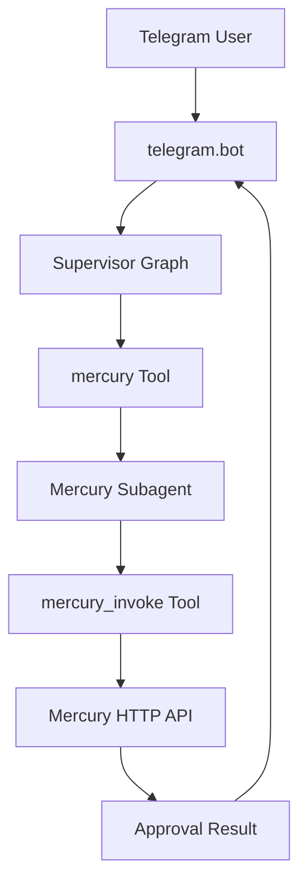
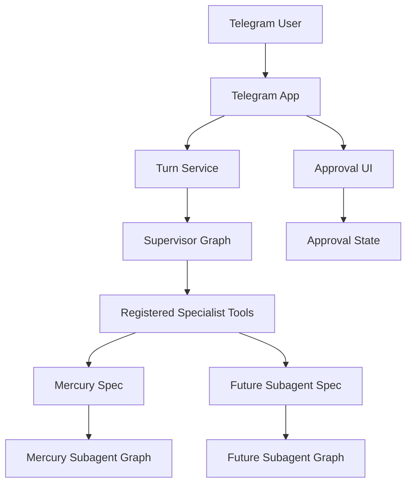

# Juno Refactoring Plan

## Goal

Move Juno toward a composable multi-subagent architecture without breaking the current Mercury + Telegram behavior. The refactor should make “add a new subagent” mostly a matter of adding a manifest, builder/runner registration, and tests, rather than editing the supervisor and Telegram bot in several unrelated places.

## Current Architecture To Preserve



Important existing behavior to keep stable:

- The supervisor still exposes a `mercury` tool for current prompts, tests, and checkpointed threads.
- The Mercury specialist still exposes `mercury_invoke` and preserves idempotency/approval semantics.
- Telegram inline approval still produces `approval_response` and resumes the same pending Mercury operation.
- Existing settings such as `MERCURY_BASE_URL`, `MERCURY_HTTP_PATH`, and `MERCURY_REQUEST_BODY_MODE` keep working.

## Target Architecture



## Phase 1: Introduce Subagent Registration

Add a small agent registry layer before making broad Telegram changes.

Create a new module such as [`src/juno/agents/registry.py`](src/juno/agents/registry.py) with a lightweight data structure:

```python
@dataclass(frozen=True)
class SubagentSpec:
    name: str
    description: str
    graph: CompiledStateGraph
    state_keys: tuple[str, ...]
    resume_instruction: str | None = None
```

Refactor [`src/juno/agents/build_supervisor.py`](src/juno/agents/build_supervisor.py):

- Change `build_supervisor` to accept a sequence of `SubagentSpec` objects or prebuilt `BaseTool`s.
- Generate one supervisor tool per spec.
- Keep a compatibility path where existing code can still pass `mercury_subagent`, or migrate call sites and tests together.
- Preserve `compose_supervisor_system_prompt` and `format_supervisor_tools_context`; they already support multiple tools.
- Move Mercury-specific resume copy out of the generic supervisor path and into the Mercury spec.

Expected result: the supervisor no longer knows Mercury as a special case, except through a registered spec.

## Phase 2: Add Runtime Factory For Assistants

Extract graph construction from [`src/juno/telegram/bot.py`](src/juno/telegram/bot.py) into a dedicated factory module, for example [`src/juno/runtime/factory.py`](src/juno/runtime/factory.py) or [`src/juno/agents/factory.py`](src/juno/agents/factory.py).

Responsibilities:

- Discover manifests using [`src/juno/assistants/loader.py`](src/juno/assistants/loader.py).
- Resolve assistant base URLs using `manifest.base_url_env`, falling back to existing Mercury settings where needed.
- Dispatch on `manifest.runner`.
- Build `MercuryAssistantRunner` and `build_mercury_subagent` for `runner: mercury`.
- Return the complete supervisor graph.

Keep the registry deliberately small at first:

```python
def build_subagent_specs(settings: Settings) -> list[SubagentSpec]:
    # if manifest.runner == "mercury": build Mercury spec
    # else: raise clear NotImplementedError
```

This activates the existing `runner` and `base_url_env` manifest fields without creating an overbuilt plugin framework.

## Phase 3: Split Telegram Concerns

Slim [`src/juno/telegram/bot.py`](src/juno/telegram/bot.py) into a composition root: load settings/identity, build application, register handlers, start polling, shut down.

Extract these modules:

- [`src/juno/telegram/approval_ui.py`](src/juno/telegram/approval_ui.py): approval keyboard decision logic, approval text heuristics, keyboard creation, approval state value formatting.
- [`src/juno/telegram/approval_state.py`](src/juno/telegram/approval_state.py): pending approval and last approval token storage. Prefer `application.bot_data` over module-level globals.
- [`src/juno/telegram/messages.py`](src/juno/telegram/messages.py): `_final_ai_content`, message content normalization, and blob extraction from AI/tool messages.
- [`src/juno/telegram/turn.py`](src/juno/telegram/turn.py): one supervisor turn, typing loop, approval merge, graph invocation, response sending.
- [`src/juno/telegram/handlers.py`](src/juno/telegram/handlers.py): command handlers and callback/message handlers.

Keep [`src/juno/telegram/session.py`](src/juno/telegram/session.py), [`src/juno/telegram/parsing.py`](src/juno/telegram/parsing.py), and [`src/juno/telegram/errors.py`](src/juno/telegram/errors.py) as they are unless small import updates are needed.

## Phase 4: Make Approval Flow Less Text-Coupled

Short term: preserve the current phrase-based approval detection so behavior does not regress.

Medium term: move toward a structured approval signal:

- Keep `AssistantTurnWalletApproval` as the canonical result type in [`src/juno/assistants/protocol.py`](src/juno/assistants/protocol.py).
- Avoid making Telegram infer behavior only from free-form text emitted by [`src/juno/agents/mercury_payload.py`](src/juno/agents/mercury_payload.py).
- If LangChain tool messages require text, emit a stable machine-readable marker or JSON envelope alongside the model-facing text.
- Gate Telegram approval UI by subagent capability, e.g. `supports_approval_ui`, so future non-wallet subagents do not trigger Mercury approval keyboards by accident.

This phase can be done after the module split, because the current tests already lock down the existing text behavior.

## Phase 5: Generalize Runner/Protocol Carefully

Do not rename everything upfront. Keep `MercuryAssistantRunner` and Mercury protocol names stable until a second real subagent proves which parts are shared.

Incremental path:

- Use `manifest.base_url_env` for Mercury first.
- Add a small runner dispatch function keyed by `manifest.runner`.
- Keep `AssistantTurnSuccess`, `AssistantTurnAgentError`, `AssistantTurnHttpError`, and `AssistantTurnWalletApproval` as shared result types.
- Consider a generic `HttpAssistantRunner` only when another assistant has the same POST JSON + result shape.
- If another assistant has a different response contract, add a parser callable instead of forcing it through `parse_mercury_body`.

## Phase 6: Tests

Update existing tests while keeping coverage focused.

Agent and registry tests:

- Extend [`tests/test_agents.py`](tests/test_agents.py) to verify a supervisor can register multiple subagent specs and includes all tools in the system prompt.
- Keep Mercury two-step path tests passing.
- Add a test that state keys are forwarded per subagent spec.

Factory tests:

- Add tests for the new runtime factory using patched manifests/settings.
- Verify missing Mercury manifest and missing base URL still produce clear errors.
- Verify `manifest.base_url_env` is honored.

Telegram tests:

- Move approval heuristic tests from private imports in [`tests/test_telegram_bot.py`](tests/test_telegram_bot.py) to public functions in `approval_ui.py`.
- Add tests for `approval_state.py` using fake `bot_data`.
- Add turn-level tests that mock the supervisor graph and Telegram bot to verify approval merge, plain reply, approval keyboard reply, and error formatting.

Mercury tests:

- Keep [`tests/test_mercury.py`](tests/test_mercury.py) and [`tests/test_mercury_invoke_payload.py`](tests/test_mercury_invoke_payload.py) focused on Mercury protocol and payload behavior.
- Add regression coverage for same-intent approval retry if not already covered at the turn or agent level.

## Phase 7: Documentation

Update [`README.md`](README.md) after the implementation:

- Explain the new assistant registration flow.
- Document what is currently generic versus Mercury-specific.
- Show the minimum steps for adding a future subagent.
- Keep the existing Mercury setup instructions and environment variables.

Optionally add a short developer note, for example [`docs/subagents.md`](docs/subagents.md), with:

- Manifest fields.
- Runner dispatch expectations.
- Required tests for a new subagent.
- Approval UI capability rules.

## Suggested Implementation Order

1. Add `SubagentSpec` and refactor `build_supervisor` around registered specs while preserving Mercury behavior.
2. Extract runtime factory from Telegram and move Mercury construction there.
3. Split Telegram approval/message/turn helpers into focused modules.
4. Move approval state from module globals into `application.bot_data`.
5. Add structured approval signal support or stable marker parsing.
6. Update README/docs.
7. Run the relevant test suite and fix regressions.

## Main Risks

- Changing tool names can break prompts, tests, and existing checkpointed conversations. Keep `mercury` and `mercury_invoke` stable.
- Approval resume behavior is fragile because idempotency and same-intent retry matter. Treat this as a regression-sensitive path.
- Splitting `bot.py` can accidentally alter event-loop behavior. Preserve the current `asyncio.to_thread(supervisor.invoke, ...)` approach.
- Making abstractions too broad before a second real subagent exists could add unnecessary complexity. Prefer a small registry and explicit `runner` dispatch first.

## Definition Of Done

- Current Mercury Telegram behavior remains unchanged from a user perspective.
- `build_supervisor` can be built from a list of subagent specs/tools.
- Runtime construction no longer lives inside `telegram/bot.py`.
- Telegram approval, state, message extraction, and turn execution are independently testable modules.
- Tests cover both the existing Mercury path and the new extension point for future subagents.
- Documentation explains how to add the next subagent without editing unrelated Telegram logic.